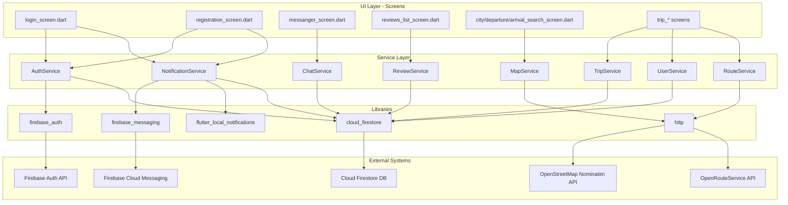

# Структурна схема системи (для захисту)

Цей документ зроблений так, щоб можна було швидко намалювати чисту структурну схему без змішування шарів.

## 1) Правило розділення (що з чим можна з'єднувати)

- `UI Layer` -> тільки `Service Layer`
- `Service Layer` -> `External APIs / Firebase / DB`
- `UI Layer` -> не звертається напряму до `API` або `Firestore`

## 2) Схема зв'язків (Mermaid)

## 3) Таблиця "API/DB/Library" без змішування

| Шар | Сутності | Де використовувати |
|---|---|---|
| UI | `screens/*` | Тільки рендер, валідація форм, навігація |
| Service | `auth_service.dart`, `chat_service.dart`, `map_service.dart`, `review_service.dart`, `trip_service.dart`, `user_service.dart`, `route_service.dart`, `notification_service.dart` | Бізнес-логіка + доступ до зовнішніх ресурсів |
| Libraries | `firebase_auth`, `cloud_firestore`, `firebase_messaging`, `flutter_local_notifications`, `http` | Імпорти в сервісах |
| External | Firebase Auth, Firestore, FCM, Nominatim | Доступ тільки через сервіси |

## 4) Поточний аудит (стан після останніх змін)

### Вже приведено до clean-підходу

- `lib/screens/registration_screen.dart` -> `AuthService`, без прямого Firestore/Auth доступу
- `lib/screens/login_screen.dart` -> `AuthService` + `NotificationService`
- `lib/screens/main_screen.dart` -> `ChatService` для unread-count
- `lib/screens/messanger_screen.dart` -> `ChatService`
- `lib/screens/my_trips_screen.dart` -> `TripService`
- `lib/screens/trip_summary_screen.dart` -> `TripService` + `UserService`
- `lib/screens/trip_details_screen.dart` -> `TripService` + `UserService` + `ReviewService`
- `lib/screens/public_profile_screen.dart` -> `UserService`
- `lib/screens/edit_profile_screen.dart` -> `UserService`
- `lib/screens/review_screen.dart` -> `ReviewService` + `UserService`
- `lib/screens/trips_list_screen.dart` -> `TripService`
- `lib/screens/route_selection_screen.dart` -> `RouteService`
- `lib/screens/trip_details_map_screen.dart` -> `RouteService`
- `lib/screens/reviews_list_screen.dart` -> `ReviewService`
- `lib/screens/city_search_screen.dart`, `lib/screens/departure_search_screen.dart`, `lib/screens/arrival_search_screen.dart` -> `MapService`

### Ще залишився змішаний доступ

- На рівні `UI -> Firestore/HTTP` прямих звернень більше немає.

## 5) Як намалювати схему для презентації

1. Ліворуч: `UI Layer` (всі екрани).
2. По центру: `Service Layer` (6 сервісів).
3. Праворуч зверху: `Libraries`.
4. Праворуч знизу: `External Systems` (Auth, Firestore, FCM, Nominatim).
5. Стрілки тільки у напрямку: `UI -> Service -> Libraries -> External`.

Це і є "без змішування" для пояснення на захисті.

