# Структурна схема системи (для захисту) - ПіЇХАЛИ РАЗОМ v2.0

## 1. Архітектурна концепція 
**Чотирирівнева архітектура** з чітким розділенням відповідальності:
- **UI Layer** — виключно рендеринг (дані від ViewModels)
- **Service Layer** — бізнес-логіка (взаємодія з БД/API)
- **Libraries Layer** — Firebase & HTTP клієнти
- **External Systems** — віддалені сервіси

---

## 2. Детальна схема (Mermaid) — для презентації

```mermaid
flowchart TD
  subgraph SCREENS ["🎨 UI LAYER (Screens & Widgets)"]
    S1["🔐 AuthScreens<br/>• login_screen.dart<br/>• registration_screen.dart"]
    S2["🚗 TripScreens<br/>• trips_list_screen.dart<br/>• trip_summary_screen.dart<br/>• trip_details_screen.dart<br/>• trip_details_map_screen.dart"]
    S3["📍 LocationScreens<br/>• city_search_screen.dart<br/>• departure_search_screen.dart<br/>• arrival_search_screen.dart<br/>• stops_selection_screen.dart"]
    S4["📦 BookingScreens<br/>• driver_booking_request_screen.dart"]
    S5["💬 CommunicationScreens<br/>• messanger_screen.dart<br/>• reviews_list_screen.dart<br/>• review_screen.dart"]
    S6["👤 UserScreens<br/>• public_profile_screen.dart<br/>• edit_profile_screen.dart"]
    S7["🎯 UtilityScreens<br/>• search_screen.dart<br/>• settings_screen.dart<br/>• main_screen.dart<br/>• route_selection_screen.dart"]
  end

  subgraph MODELS ["📊 DATA MODELS<br/>(Domain Objects)"]
    M1["User<br/>• id, name, email<br/>• photoUrl, rating<br/>• cars: List&lt;Car&gt;"]
    M2["Trip<br/>• origin, destination<br/>• departureTime, status<br/>• driverId, passengers<br/>• availableSeats"]
    M3["Car<br/>• brand, model<br/>• color, seats"]
    M4["Message<br/>• senderId, receiverId<br/>• text, imageUrl<br/>• sentAt, isRead"]
    M5["Review<br/>• fromUserId, toUserId<br/>• rating, comment<br/>• tripId, createdAt"]
    M6["BookingRequest<br/>• tripId, passengerId<br/>• status, createdAt"]
  end

  subgraph SERVICES ["⚙️ SERVICE LAYER<br/>(Business Logic)"]
    SV1["AuthService<br/>• signInWithEmailAndPassword()<br/>• registerUser(RegistrationRequest)<br/>→ Firebase Auth, Firestore"]
    SV2["NotificationService<br/>• initialize()<br/>• requestPermissionsAgain()<br/>• refreshToken()<br/>→ FCM, Local Notifications"]
    SV3["ChatService<br/>• sendMessage(), sendImageMessage()<br/>• getConversationMessages(uid)<br/>• getUnreadMessagesCount()<br/>• markIncomingAsRead()<br/>→ Firestore, Firebase Storage"]
    SV4["ReviewService<br/>• addReview(), submitReview()<br/>• getReviewsForUser(userId)<br/>• hasUserReviewedTrip()<br/>• recalculateAndStoreUserRating()<br/>→ Firestore"]
    SV5["MapService<br/>• searchAddresses(query)<br/>• searchLocalOnly(query)<br/>• searchAddressesForDeparture()<br/>• searchAddressesForArrival()<br/>→ HTTP: Nominatim API<br/>→ Local: ukraine_cities.json"]
    SV6["TripService<br/>• createTrip(), getTripById()<br/>• getTripsByCities(), getUserTrips()<br/>• bookSeat(), cancelBooking()<br/>• validateDriverScheduleForNewTrip()<br/>→ Firestore (transactions)"]
    SV7["UserService<br/>• loadUserData(), loadUser()<br/>• uploadProfilePhoto()<br/>• addCar(), deleteCar()<br/>• updateUserRating()<br/>→ Firestore, Firebase Storage"]
    SV8["RouteService<br/>• fetchAlternativeRoutes()<br/>• fetchRouteWithWaypoints()<br/>• fetchRouteForTrip()<br/>→ HTTP: OpenRouteService API"]
    SV9["BookingService<br/>• createBookingRequest()<br/>• confirmBookingRequest()<br/>• rejectBookingRequest()<br/>• cancelLatestByPassenger()<br/>→ Firestore (transactions)<br/>→ ChatService (notifications)"]
    SV10["CarDataService<br/>• loadCarData(), getBrands()<br/>• getModelsForBrand(), getColors()<br/>→ Local: car_brands.json"]
  end

  subgraph LIBS ["📚 LIBRARIES/PACKAGES"]
    L1["🔑 firebase_auth"]
    L2["💾 cloud_firestore"]
    L3["📤 firebase_storage"]
    L4["💌 firebase_messaging"]
    L5["🔔 flutter_local_notifications"]
    L6["🌐 http/dio"]
    L7["🗺️ latlong2, google_maps_flutter"]
  end

  subgraph EXTERNAL ["☁️ EXTERNAL SYSTEMS"]
    E1["Firebase Auth<br/>(Authentication)"]
    E2["Cloud Firestore<br/>(Real-time DB)"]
    E3["Firebase Storage<br/>(Files/Images)"]
    E4["FCM<br/>(Notifications)"]
    E5["Nominatim OSM<br/>(Geocoding)"]
    E6["OpenRouteService API<br/>(Routing)"]
    E7["Local Assets<br/>(JSON files)"]
  end

  %% ───────────────────────── UI → Services ──────────────────────────
  S1 -->|"uses"| SV1
  S1 -->|"uses"| SV2
  S2 -->|"uses"| SV6
  S2 -->|"uses"| SV7
  S2 -->|"uses"| SV8
  S3 -->|"uses"| SV5
  S4 -->|"uses"| SV9
  S5 -->|"uses"| SV3
  S5 -->|"uses"| SV4
  S6 -->|"uses"| SV7
  S7 -->|"uses"| SV1
  S7 -->|"uses"| SV6

  %% ───────────────────────── Services use Models ──────────────────────────
  SV1 -.->|"returns"| M1
  SV3 -.->|"reads/writes"| M4
  SV4 -.->|"reads/writes"| M5
  SV5 -.->|"reads"| M3
  SV6 -.->|"reads/writes"| M2
  SV7 -.->|"reads/writes"| M1
  SV8 -.->|"reads"| M2
  SV9 -.->|"reads/writes"| M6

  %% ───────────────────────── Services → Libraries ──────────────────────────
  SV1 -->|"uses"| L1
  SV1 -->|"uses"| L2
  SV2 -->|"uses"| L4
  SV2 -->|"uses"| L5
  SV3 -->|"uses"| L2
  SV3 -->|"uses"| L3
  SV4 -->|"uses"| L2
  SV5 -->|"uses"| L6
  SV6 -->|"uses"| L2
  SV7 -->|"uses"| L2
  SV7 -->|"uses"| L3
  SV8 -->|"uses"| L6
  SV8 -->|"uses"| L7
  SV9 -->|"uses"| L2
  SV10 -->|"local load"| L7

  %% ───────────────────────── Libraries → External ──────────────────────────
  L1 -->|"HTTP/gRPC"| E1
  L2 -->|"WebSocket/HTTP"| E2
  L3 -->|"HTTP (upload)"| E3
  L4 -->|"HTTP (tokens)"| E4
  L5 -->|"local"| E4
  L6 -->|"HTTP GET/POST"| E5
  L6 -->|"HTTP POST"| E6
  L7 -->|"file read"| E7
```



---

## 3. Деталізована таблиця по шарам

### 📊 SERVICE LAYER (10 сервісів)

| Сервіс | Методи | БД/API | Примітка |
|--------|--------|--------|----------|
| **AuthService** | `signInWithEmailAndPassword()`, `registerUser()` | Firebase Auth, Firestore | Реєстрація та вхід |
| **NotificationService** | `initialize()`, `refreshToken()`, `requestPermissionsAgain()` | FCM, Local Notif. | Синглтон, глобальна ініціалізація |
| **ChatService** | `sendMessage()`, `sendImageMessage()`, `getConversationMessages()`, `markIncomingAsRead()`, `loadUserSummary()` | Firestore, Storage | Чати D2D + System messages |
| **ReviewService** | `addReview()`, `getReviewsForUser()`, `hasUserReviewedTrip()`, `recalculateAndStoreUserRating()` | Firestore | Рейтинги та відгуки |
| **MapService** | `searchAddresses()`, `searchLocalOnly()`, `searchAddressesForDeparture()`, `searchAddressesForArrival()` | Nominatim API, Local JSON | Fuzzy + API пошук |
| **TripService** | `createTrip()`, `getTripById()`, `bookSeat()`, `cancelTrip()`, `validateDriverScheduleForNewTrip()` | Firestore (transactions) | Управління поїздками, конфлікти |
| **UserService** | `loadUser()`, `uploadProfilePhoto()`, `addCar()`, `updateUserRating()` | Firestore, Storage | Профілі та машини |
| **RouteService** | `fetchRouteWithWaypoints()`, `fetchAlternativeRoutes()`, `fetchRouteForTrip()` | OpenRouteService API | 3D маршрути |
| **BookingService** | `createBookingRequest()`, `confirmBookingRequest()`, `rejectBookingRequest()` | Firestore (transactions), ChatService | Запити на місця + система сповіщень |
| **CarDataService** | `getBrands()`, `getModelsForBrand()`, `getColors()` | Local: car_brands.json | Singleton, кеш |

---

## 4. Екрани й їхній сервіс-стек

| Екран | Сервіси | CRUD-операції |
|--------|---------|---|
| **login_screen.dart** | AuthService + NotificationService | READ: User |
| **registration_screen.dart** | AuthService | CREATE: User |
| **trips_list_screen.dart** | TripService | READ: [Trip] |
| **trip_summary_screen.dart** | TripService + UserService | READ: Trip, User |
| **trip_details_screen.dart** | TripService + UserService + ReviewService | READ: Trip, Reviews |
| **city_search_screen.dart** | MapService | READ: [Location] (Nominatim) |
| **departure_search_screen.dart** | MapService | READ: [Location] |
| **arrival_search_screen.dart** | MapService | READ: [Location] |
| **messanger_screen.dart** | ChatService | READ/UPDATE: [Message] |
| **reviews_list_screen.dart** | ReviewService | READ: [Review] |
| **review_screen.dart** | ReviewService + UserService | CREATE: Review, UPDATE: Rating |
| **public_profile_screen.dart** | UserService + ReviewService | READ: User, Reviews |
| **edit_profile_screen.dart** | UserService + CarDataService | UPDATE: User, Cars |
| **driver_booking_request_screen.dart** | BookingService | READ: BookingRequest, UPDATE: Status |
| **route_selection_screen.dart** | RouteService | READ: Route |
| **trip_details_map_screen.dart** | RouteService + MapService | READ: Route, Polyline |

---

## 5. Потоки даних (Data Flow)

### 🔄 User Registration Flow
```
RegistrationScreen
  ↓ (RegistrationRequest)
AuthService.registerUser()
  ↓ creates...
Firebase Auth (account) + Firestore (users collection)
  ↓ returns
User model + firebaseUser.uid
```

### 🔄 Chat Flow
```
MessengerScreen
  ↓ (currentUserId, receiverId, text)
ChatService.sendMessage()
  ↓ writes to
Firestore: messages collection
  ↓ listens to
Stream<[Message]> via getConversationMessages()
  ↓ displays
MessengerScreen (rebuilds on new messages)
```

### 🔄 Trip Search & Booking Flow
```
TripsListScreen
  ↓ (fromCity, toCity)
TripService.getTripsByCities()
  ↓ queries
Firestore: trips collection
  ↓ shows
[Trip] results
  ↓ user selects trip
DriverBookingRequestScreen
  ↓ calls
BookingService.createBookingRequest()
  ↓ writes to + notifies
Firestore + ChatService (system message to driver)
```

### 🔄 Location Search Flow
```
CitySearchScreen (user types "Київ")
  ↓ (query)
MapService.searchAddresses()
  ↓ parallel:
    1. searchLocalOnly() → ukraine_cities.json (instant)
    2. _fetchNominatim() → HTTP GET to Nominatim API
  ↓ merges & deduplicates
[Location] with lat/lng
  ↓ displays
dropdown of cities
```

### 🔄 Route Display Flow
```
TripDetailsMapScreen
  ↓ (tripId)
TripService.getTripById()
  ↓ extracts lat/lng
RouteService.fetchAlternativeRoutes()
  ↓ HTTP POST to OpenRouteService
[{polyline, distance, duration}]
  ↓ draws on
FlutterMap with polylines
```

---

## 6. Графік залежностей сервісів

- **AuthService** — незалежна (базис)
- **NotificationService** — незалежна (синглтон)
- **UserService** — незалежна
- **MapService** — незалежна (локальні JSON + HTTP)
- **CarDataService** — незалежна (локальний кеш)
- **ChatService** — незалежна (Firestore + Storage)
- **ReviewService** — незалежна
- **RouteService** — незалежна (HTTP)
- **TripService** — незалежна (Firestore) 
- **BookingService** → залежить від **ChatService** (для system messages)

```
Diagrams of dependencies:
┌──────────────────────────────────────┐
│ Independent Services                  │
│ • AuthService                         │
│ • NotificationService                 │
│ • UserService                         │
│ • MapService                          │
│ • CarDataService                      │
│ • ChatService                         │
│ • ReviewService                       │
│ • RouteService                        │
│ • TripService                         │
└──────────────────────────────────────┘
         ↑                    ↑
         └────────┬──────────┘
                  │
        BookingService (uses ChatService)
```

---

## 7. Правила архітектури (для захисту)

✅ **ДОЗВОЛЕНО:**
- UI вызывает методи сервісів
- Сервіси звертаються до Firebase/HTTP/Local
- Передача моделей между слоями
- Dependency Injection (конструктори)

❌ **ЗАБОРОНЕНО:**
- UI прямо до Firebase/HTTP
- Прямі import http у екранах
- Firestore queries у UI логіці
- Циклічні залежності між сервісами

---

## 8. Для презентації: як це намалювати

**Структура на дошці:**

```
╔════════════════════════════════════════════════════════════╗
║              🎨 UI LAYER (Screens)                         ║
║   Auth | Trip | Location | Booking | Chat | Profile ...  ║
╠════════════════════════════════════════════════════════════╣
║              ⚙️ SERVICE LAYER                              ║
║  Auth | Notification | Chat | Review | Map | Trip |      ║
║  User | Route | Booking | CarData                         ║
╠════════════════════════════════════════════════════════════╣
║              📚 LIBRARIES/PACKAGES                         ║
║  firebase_auth | cloud_firestore | firebase_storage      ║
║  firebase_messaging | flutter_local_notifications | http   ║
╠════════════════════════════════════════════════════════════╣
║              ☁️ EXTERNAL SYSTEMS                           ║
║  Firebase Auth | Firestore | Storage | FCM | APIs        ║
║  (Nominatim, OpenRouteService)                            ║
╚════════════════════════════════════════════════════════════╝

Стрілки: UI → Services → Libraries → External
(унідирекційний потік даних, без циклів)
```

---

## 9. Clean Architecture Compliance

| Принцип | Статус | Примітка |
|---------|--------|----------|
| **Single Responsibility** | ✅ Дотримано | Кожен сервіс — одна сфера |
| **Open/Closed** | ✅ Дотримано | Легко додати новий сервіс |
| **Liskov Substitution** | ✅ Д частково | Interface-based dependency injection |
| **Interface Segregation** | ✅ Дотримано | Методи — чітко розділені |
| **Dependency Inversion** | ✅ Дотримано | Services через DI, не new() |
| **No cross-layer calls** | ✅ Дотримано | UI → Service → Libraries → External |

---

**Версія:** 2.0  
**Остаточно:** 18.05.2026  
**Готово для захисту:** ✅ YES

